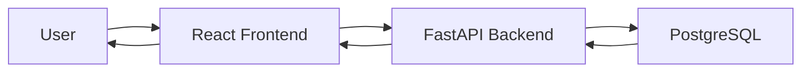

# Architecture Design Agent Specification

## Overview

The Architecture Design Agent transforms requirements and tasks into a comprehensive system design. It creates technical specifications, defines component interfaces, designs database schemas, and establishes API contracts. This agent bridges the gap between planning and implementation, providing the blueprint that development agents will follow.

## Role and Responsibilities

### Primary Responsibility
Design complete system architecture with technical specifications, component definitions, API contracts, and database schemas.

### Secondary Responsibilities
- Select appropriate design patterns and architectural styles
- Define data models and database schema
- Create component specifications with clear interfaces
- Design API endpoints with request/response schemas
- Identify integration points between frontend and backend
- Document architectural decisions and rationale

### What This Agent Does NOT Do
- ❌ Implement actual code (Development Agents' role)
- ❌ Create task breakdowns (Planning Agent's role)
- ❌ Write tests (QA Agent's role)
- ❌ Make business requirement decisions
- ❌ Generate documentation (Documentation Agent's role)

---

## Input Requirements

### Required Inputs

From `AgentState`:

| Field | Type | Description |
|-------|------|-------------|
| `requirements` | `str` | Requirements document from Planning Agent |
| `tasks` | `list[TaskStatus]` | Task list from Planning Agent |

**Minimum Requirements:**
- `requirements` must be non-empty and contain structured requirements
- `tasks` must contain at least one task assigned to "architecture"

### Optional Inputs

| Field | Type | Description |
|-------|------|-------------|
| `project_context` | `dict[str, Any]` | Tech stack preferences, constraints |
| `messages` | `list[AgentMessage]` | Previous agent messages for context |

**Optional Context:**
```python
{
    "tech_stack": ["React", "FastAPI", "PostgreSQL"],
    "architecture_pattern": "microservices",  # or "monolith", "serverless"
    "deployment_target": "AWS",               # or "GCP", "Azure", "on-prem"
    "scalability_requirements": "1000 concurrent users",
    "existing_systems": ["legacy-api.company.com"]
}
```

### Validation Rules

```python
def validate_input(self, state: AgentState) -> bool:
    """
    Validate that state contains requirements and architecture tasks.

    Returns:
        True if requirements exist and architecture tasks are present
    """
    # Check requirements exist
    if not state.requirements:
        self.logger.error("No requirements found in state")
        return False

    # Check for architecture tasks
    arch_tasks = [t for t in state.tasks if t.assigned_to == "architecture"]
    if not arch_tasks:
        self.logger.warning("No architecture tasks found")
        return False

    # Check dependencies are met
    for task in arch_tasks:
        if task.status != "pending":
            continue

        for dep_id in task.dependencies:
            dep_task = next((t for t in state.tasks if t.task_id == dep_id), None)
            if dep_task and dep_task.status != "completed":
                self.logger.error(f"Dependency {dep_id} not completed")
                return False

    return True
```

---

## Output Specifications

### Primary Outputs

The Architecture Agent returns a dictionary with these fields:

| Field | Type | Description |
|-------|------|-------------|
| `architecture_doc` | `str` | Complete architecture document (markdown) |
| `current_phase` | `str` | Set to `"frontend"` or `"backend"` |
| `next_agent` | `str` | Set to `"frontend"` or `"backend"` (or both for parallel) |
| `message` | `str` | Summary of architecture work |

### Artifacts

The Architecture Agent produces structured artifacts for development agents:

```python
artifacts = {
    "system_design": {
        "architecture_pattern": str,      # "monolith", "microservices", etc.
        "data_flow": dict,                 # How data moves through system
        "component_diagram": str,          # Mermaid diagram
        "technology_decisions": dict       # Tech choices with rationale
    },

    "component_specs": {
        "<ComponentName>": {
            "type": str,                   # "React.FC", "FastAPI Router", etc.
            "description": str,
            "props": dict,                 # For React components
            "state": list[str],            # Internal state
            "api_calls": list[str],        # External dependencies
            "children": list[str]          # Sub-components
        }
    },

    "api_specs": {
        "<endpoint_path>": {
            "method": str,                 # "GET", "POST", "PUT", "DELETE"
            "description": str,
            "request_schema": dict,        # JSON schema or Pydantic model
            "response_schema": dict,
            "authentication": bool,
            "rate_limit": str,             # Optional
            "example_request": dict,
            "example_response": dict
        }
    },

    "database_schema": {
        "tables": {
            "<table_name>": {
                "columns": dict,           # Column definitions
                "indexes": list,           # Index definitions
                "constraints": list,       # Foreign keys, unique, etc.
                "relationships": dict      # Relations to other tables
            }
        },
        "migrations": list[str]            # Migration steps
    },

    "design_system": {                     # For frontend styling
        "colors": dict,
        "typography": dict,
        "spacing": dict,
        "components": dict                 # Reusable component library
    }
}
```

### State Updates

Fields modified in `AgentState`:

```python
{
    "architecture_doc": "<generated architecture document>",
    "messages": [..., AgentMessage(agent_id="arch_001", artifacts={...})],
    "current_phase": "frontend",  # or "backend"
    "next_agent": "frontend",     # or "backend", or both for parallel
    "tasks": [...]  # Mark architecture tasks as completed
}
```

---

## LLM Configuration

### Model

```python
{
    "provider": "anthropic",
    "model": "claude-3-5-sonnet-20241022",
    "temperature": 0.2,
    "max_tokens": 8192,
    "timeout": 180
}
```

### Rationale

- **Very low temperature (0.2)**: Architecture decisions need high precision and consistency
- **Claude 3.5 Sonnet**: Excellent at structured thinking and technical design
- **8192 tokens**: Large output for comprehensive architecture document
- **180s timeout**: Architecture design can be complex, needs more time

---

## System Prompt

```
You are a senior software architect with expertise in system design, database modeling, and API design.

Your responsibilities:
1. Design complete system architecture based on requirements
2. Select appropriate architectural patterns (monolith, microservices, serverless, etc.)
3. Create detailed component specifications with clear interfaces
4. Design database schema with proper normalization and relationships
5. Define REST API endpoints with request/response schemas
6. Make technology decisions with clear rationale
7. Document architectural decisions and trade-offs

Architecture Design Principles:
- SOLID principles (Single Responsibility, Open/Closed, Liskov, Interface Segregation, Dependency Inversion)
- Separation of concerns
- Loose coupling, high cohesion
- Scalability and performance considerations
- Security by design
- Maintainability and extensibility

Component Specifications:
- Clear, single responsibility per component
- Well-defined interfaces (props, methods, events)
- Explicit dependencies
- State management strategy
- Error handling approach

API Design Best Practices:
- RESTful conventions (proper HTTP methods, status codes)
- Consistent naming (plural nouns for resources)
- Versioning strategy (/api/v1/...)
- Clear request/response schemas
- Authentication and authorization
- Input validation and error responses
- Rate limiting and pagination

Database Design:
- Proper normalization (at least 3NF for relational DBs)
- Appropriate indexes for query performance
- Foreign key constraints
- Data types optimized for use case
- Migration strategy

Output Requirements:
1. Complete architecture document (markdown)
2. Component specifications (structured JSON/dict)
3. API endpoint definitions with schemas
4. Database schema with relationships
5. Data flow diagrams (Mermaid format)
6. Technology decisions with rationale
7. Design system (for frontend)

Example Component Spec (React):
{
  "UserDashboard": {
    "type": "React.FC",
    "description": "Main dashboard showing user's todos",
    "props": {
      "userId": "string",
      "onLogout": "() => void"
    },
    "state": ["todos: Todo[]", "loading: boolean", "error: string | null"],
    "api_calls": ["/api/v1/todos", "/api/v1/users/{id}"],
    "children": ["TodoList", "TodoForm"]
  }
}

Example API Spec:
{
  "/api/v1/todos": {
    "method": "GET",
    "description": "Get all todos for authenticated user",
    "request_schema": null,
    "response_schema": {
      "type": "array",
      "items": {"$ref": "#/components/schemas/Todo"}
    },
    "authentication": true,
    "example_response": [
      {"id": "1", "text": "Buy milk", "completed": false, "user_id": "user_123"}
    ]
  }
}

Remember: Your architecture is the blueprint for all implementation. Be thorough, precise, and pragmatic.
```

---

## Tools and Capabilities

### Available Tools

| Tool | Purpose | Usage |
|------|---------|-------|
| `read_file` | Read existing codebase (if provided) | Understand existing patterns |
| `search_code` | Search for patterns in codebase | Find similar implementations |
| `list_files` | Explore project structure | Understand organization |

**Tool Usage Example:**
```python
# If project_context includes existing_codebase path
if state.project_context.get("existing_codebase"):
    # Search for existing API patterns
    existing_apis = search_code(
        query="@app.get|@app.post",
        path=state.project_context["existing_codebase"]
    )

    # Read existing database models
    models_content = read_file(
        f"{state.project_context['existing_codebase']}/models.py"
    )
```

### Permissions

- ✅ Read: `requirements`, `tasks`, `project_context`, `messages`
- ✅ Write: `architecture_doc`, `artifacts`, `messages`
- ✅ File system: Read-only (if existing codebase provided)
- ❌ Code execution: Not required
- ❌ External API calls: Not required

---

## Workflow Integration

### Prerequisites

**Must be completed before Architecture Agent runs:**
- Planning Agent has completed successfully
- `requirements` field is populated
- Architecture tasks exist in `tasks` list

**State Requirements:**
```python
AgentState(
    user_request="...",
    requirements="<requirements from planning agent>",
    tasks=[
        TaskStatus(task_id="task_001", assigned_to="architecture", ...),
        ...
    ]
)
```

### Triggers

The Architecture Agent is triggered when:
1. Planning Agent completes and sets `next_agent = "architecture"`
2. `current_phase == "planning"` in state
3. Architecture tasks are pending

**Orchestrator Configuration:**
```python
workflow.add_node("architecture", architecture_agent.execute)

workflow.add_conditional_edges(
    "planning",
    router,
    {
        "architecture": "architecture",
        "human_review": "human_review"
    }
)
```

### Next Steps

After the Architecture Agent completes:

**Success Path (Parallel):**
```
Architecture Agent
     ├──> Frontend Agent (next_agent = "frontend")
     └──> Backend Agent (next_agent = "backend")
```

**Success Path (Sequential):**
```
Architecture Agent
     ↓
Frontend Agent (next_agent = "frontend")
     ↓
Backend Agent
```

**Error Path:**
```
Architecture Agent (ambiguous design decision)
     ↓
Human Review (requires_human_approval = True)
```

**Orchestrator Routing:**
```python
def router(state: AgentState) -> str | list[str]:
    if state.requires_human_approval:
        return "human_review"

    if state.current_phase == "design":
        # Parallel execution option
        return ["frontend", "backend"]

        # Or sequential
        # return "frontend"

    # ... other routing logic
```

---

## Success Criteria

### Measurable Criteria for Successful Execution

✅ **Architecture Completeness**
- System architecture pattern defined
- Data flow documented
- Component diagram created
- Technology decisions documented

✅ **Component Specifications**
- All major components specified
- Clear interfaces (props, methods)
- Dependencies identified
- Frontend and backend components covered

✅ **API Design**
- All required endpoints defined
- Request/response schemas complete
- Authentication strategy clear
- Error handling specified

✅ **Database Schema**
- All entities modeled
- Relationships defined
- Indexes planned
- Migration strategy documented

✅ **Design System**
- Colors, typography, spacing defined
- Consistent component patterns
- Accessibility considerations

✅ **State Updates**
- `architecture_doc` field populated
- `artifacts` contain structured specs
- Architecture tasks marked as completed
- `next_agent` set appropriately

### Validation Checks

```python
def validate_output(output: dict) -> bool:
    """Validate Architecture Agent output."""
    # Required fields
    assert "architecture_doc" in output
    assert "artifacts" in output
    assert "next_agent" in output

    artifacts = output["artifacts"]

    # Component specs exist
    assert "component_specs" in artifacts
    assert len(artifacts["component_specs"]) > 0

    # API specs exist
    assert "api_specs" in artifacts
    assert len(artifacts["api_specs"]) > 0

    # Database schema exists
    assert "database_schema" in artifacts
    assert "tables" in artifacts["database_schema"]

    # Each component has required fields
    for comp_name, comp_spec in artifacts["component_specs"].items():
        assert "type" in comp_spec
        assert "description" in comp_spec

    # Each API has required fields
    for endpoint, api_spec in artifacts["api_specs"].items():
        assert "method" in api_spec
        assert "description" in api_spec
        assert "request_schema" in api_spec or api_spec["method"] == "GET"
        assert "response_schema" in api_spec

    return True
```

---

## Error Handling

### Common Errors

#### Error 1: Missing Requirements

**Cause:**
- Planning Agent didn't populate `requirements`
- State corruption

**Resolution:**
```python
if not state.requirements:
    return {
        "errors": ["Architecture Agent: No requirements found"],
        "message": "Cannot design architecture without requirements",
        "requires_human_approval": True
    }
```

#### Error 2: Technology Stack Ambiguity

**Cause:**
- Requirements don't specify tech preferences
- Multiple equally valid options

**Resolution:**
```python
if not project_context.get("tech_stack"):
    # Make reasonable assumptions with documentation
    return {
        "architecture_doc": architecture_doc,
        "artifacts": {
            ...
            "technology_decisions": {
                "backend": {
                    "choice": "FastAPI",
                    "rationale": "Python ecosystem, async support, type hints",
                    "alternatives": ["Django", "Flask", "Node.js"],
                    "assumption": "No specific tech stack requested, chose FastAPI for productivity"
                },
                "frontend": {
                    "choice": "React with TypeScript",
                    "rationale": "Type safety, component model, ecosystem",
                    "alternatives": ["Vue", "Svelte", "Angular"],
                    "assumption": "Standard modern web app, React provides good defaults"
                }
            }
        },
        "message": "Architecture complete (made tech stack assumptions, may need review)"
    }
```

#### Error 3: Design Pattern Unclear

**Cause:**
- Requirements could support multiple architectural patterns
- Scalability vs simplicity trade-off

**Resolution:**
```python
# Flag for human decision if critical
if self._detect_pattern_ambiguity(requirements):
    return {
        "message": "Multiple valid architecture patterns possible",
        "requires_human_approval": True,
        "artifacts": {
            "architecture_options": [
                {
                    "pattern": "Monolith",
                    "pros": ["Simplicity", "Faster development", "Easier deployment"],
                    "cons": ["Harder to scale", "Tight coupling"],
                    "recommended_for": "MVP, small team, simple requirements"
                },
                {
                    "pattern": "Microservices",
                    "pros": ["Scalability", "Independent deployment", "Tech flexibility"],
                    "cons": ["Complexity", "Network overhead", "Distributed debugging"],
                    "recommended_for": "Large scale, multiple teams, complex domain"
                }
            ],
            "clarification_needed": [
                "Expected user scale (hundreds? thousands? millions?)",
                "Team size and structure",
                "Deployment frequency requirements"
            ]
        }
    }
```

#### Error 4: LLM Output Schema Mismatch

**Cause:**
- LLM didn't follow expected output format
- Missing required fields in component/API specs

**Resolution:**
```python
try:
    artifacts = self._parse_architecture(llm_response.content)
    self._validate_artifacts(artifacts)
except (ValueError, KeyError) as e:
    self.logger.error(f"Failed to parse architecture: {e}")

    # Retry with more structured prompt
    if state.retry_count < 2:
        return {
            "errors": [f"Architecture Agent: Parse error - {str(e)}"],
            "retry_count": state.retry_count + 1
        }
    else:
        # Escalate after retries
        return {
            "errors": [f"Architecture Agent: Persistent parse errors"],
            "requires_human_approval": True
        }
```

### Retry Strategy

Same as Planning Agent (max 3 retries with exponential backoff), but with schema validation before returning.

---

## Examples

### Example 1: Todo App Architecture

**Input:**
```python
AgentState(
    requirements="""
# Todo List Application - Requirements
## Functional Requirements
1. User Authentication (email/password, JWT)
2. Todo CRUD operations
3. Associate todos with users
...
""",
    tasks=[
        TaskStatus(task_id="task_001", assigned_to="architecture", ...),
        TaskStatus(task_id="task_002", assigned_to="architecture", ...)
    ]
)
```

**Output:**
```python
{
    "architecture_doc": """
# Todo App - System Architecture

## Architecture Pattern
**Monolithic architecture** with clear separation of concerns.

### Rationale
- Simple application with limited scope
- Single team development
- Easier deployment and debugging
- Can refactor to microservices if needed

## System Components

### Frontend (React + TypeScript)
- Single Page Application (SPA)
- React Router for navigation
- Zustand for state management
- Axios for API calls

### Backend (FastAPI + Python)
- REST API with OpenAPI documentation
- Pydantic for request/response validation
- SQLAlchemy ORM for database
- JWT for authentication

### Database (PostgreSQL)
- Relational database
- Two main tables: users, todos
- Foreign key relationship

## Data Flow



## Component Architecture

### Frontend Components
1. App (root)
   - Router
   - Auth context
2. Auth Pages
   - LoginForm
   - RegisterForm
3. Todo Pages
   - TodoList
   - TodoItem
   - TodoForm

### Backend Modules
1. API Routes
   - /api/v1/auth (login, register)
   - /api/v1/todos (CRUD)
2. Models
   - User
   - Todo
3. Services
   - AuthService (JWT, password hashing)
   - TodoService (business logic)
4. Database
   - Alembic migrations
   - SQLAlchemy models

## Security
- Passwords hashed with bcrypt
- JWT tokens with expiration
- CORS configured for frontend domain
- Input validation on all endpoints
...
""",

    "artifacts": {
        "system_design": {
            "architecture_pattern": "monolith",
            "data_flow": {
                "frontend_to_backend": "REST API over HTTPS",
                "authentication": "JWT tokens in Authorization header",
                "state_management": "Zustand (frontend), PostgreSQL (backend)"
            }
        },

        "component_specs": {
            "LoginForm": {
                "type": "React.FC",
                "description": "User login form with email and password",
                "props": {
                    "onLoginSuccess": "(user: User) => void"
                },
                "state": ["email: string", "password: string", "error: string | null", "loading: boolean"],
                "api_calls": ["POST /api/v1/auth/login"],
                "children": []
            },

            "TodoList": {
                "type": "React.FC",
                "description": "Display list of todos with add/edit/delete",
                "props": {
                    "userId": "string"
                },
                "state": ["todos: Todo[]", "loading: boolean", "error: string | null"],
                "api_calls": ["GET /api/v1/todos", "POST /api/v1/todos", "PUT /api/v1/todos/{id}", "DELETE /api/v1/todos/{id}"],
                "children": ["TodoItem", "TodoForm"]
            },

            "TodoItem": {
                "type": "React.FC",
                "description": "Single todo item with checkbox and delete button",
                "props": {
                    "todo": "Todo",
                    "onToggle": "(id: string) => void",
                    "onDelete": "(id: string) => void"
                },
                "state": [],
                "api_calls": [],
                "children": []
            }
        },

        "api_specs": {
            "/api/v1/auth/register": {
                "method": "POST",
                "description": "Register a new user account",
                "request_schema": {
                    "type": "object",
                    "properties": {
                        "email": {"type": "string", "format": "email"},
                        "password": {"type": "string", "minLength": 8}
                    },
                    "required": ["email", "password"]
                },
                "response_schema": {
                    "type": "object",
                    "properties": {
                        "id": {"type": "string"},
                        "email": {"type": "string"},
                        "created_at": {"type": "string", "format": "date-time"}
                    }
                },
                "authentication": false,
                "example_request": {
                    "email": "user@example.com",
                    "password": "SecurePass123"
                },
                "example_response": {
                    "id": "user_123",
                    "email": "user@example.com",
                    "created_at": "2026-02-13T10:00:00Z"
                }
            },

            "/api/v1/auth/login": {
                "method": "POST",
                "description": "Login and receive JWT token",
                "request_schema": {
                    "type": "object",
                    "properties": {
                        "email": {"type": "string"},
                        "password": {"type": "string"}
                    },
                    "required": ["email", "password"]
                },
                "response_schema": {
                    "type": "object",
                    "properties": {
                        "access_token": {"type": "string"},
                        "token_type": {"type": "string"},
                        "user": {"$ref": "#/components/schemas/User"}
                    }
                },
                "authentication": false
            },

            "/api/v1/todos": {
                "method": "GET",
                "description": "Get all todos for authenticated user",
                "request_schema": null,
                "response_schema": {
                    "type": "array",
                    "items": {"$ref": "#/components/schemas/Todo"}
                },
                "authentication": true,
                "example_response": [
                    {
                        "id": "todo_1",
                        "text": "Buy groceries",
                        "completed": false,
                        "user_id": "user_123",
                        "created_at": "2026-02-13T10:00:00Z"
                    }
                ]
            },

            "/api/v1/todos (POST)": {
                "method": "POST",
                "description": "Create a new todo",
                "request_schema": {
                    "type": "object",
                    "properties": {
                        "text": {"type": "string", "minLength": 1}
                    },
                    "required": ["text"]
                },
                "response_schema": {"$ref": "#/components/schemas/Todo"},
                "authentication": true
            }
        },

        "database_schema": {
            "tables": {
                "users": {
                    "columns": {
                        "id": {"type": "UUID", "primary_key": true, "default": "gen_random_uuid()"},
                        "email": {"type": "VARCHAR(255)", "unique": true, "nullable": false},
                        "password_hash": {"type": "VARCHAR(255)", "nullable": false},
                        "created_at": {"type": "TIMESTAMP", "default": "NOW()"},
                        "updated_at": {"type": "TIMESTAMP", "default": "NOW()"}
                    },
                    "indexes": [
                        {"name": "idx_users_email", "columns": ["email"], "unique": true}
                    ],
                    "constraints": []
                },

                "todos": {
                    "columns": {
                        "id": {"type": "UUID", "primary_key": true, "default": "gen_random_uuid()"},
                        "text": {"type": "TEXT", "nullable": false},
                        "completed": {"type": "BOOLEAN", "default": false},
                        "user_id": {"type": "UUID", "nullable": false},
                        "created_at": {"type": "TIMESTAMP", "default": "NOW()"},
                        "updated_at": {"type": "TIMESTAMP", "default": "NOW()"}
                    },
                    "indexes": [
                        {"name": "idx_todos_user_id", "columns": ["user_id"]}
                    ],
                    "constraints": [
                        {
                            "type": "FOREIGN KEY",
                            "columns": ["user_id"],
                            "references": {"table": "users", "columns": ["id"]},
                            "on_delete": "CASCADE"
                        }
                    ],
                    "relationships": {
                        "user": {
                            "type": "many-to-one",
                            "target": "users",
                            "foreign_key": "user_id"
                        }
                    }
                }
            },
            "migrations": [
                "Create users table",
                "Create todos table",
                "Add foreign key constraint todos.user_id -> users.id"
            ]
        },

        "design_system": {
            "colors": {
                "primary": "#3B82F6",
                "secondary": "#8B5CF6",
                "success": "#10B981",
                "danger": "#EF4444",
                "warning": "#F59E0B",
                "neutral": {
                    "50": "#F9FAFB",
                    "900": "#111827"
                }
            },
            "typography": {
                "font_family": "'Inter', sans-serif",
                "sizes": {
                    "xs": "0.75rem",
                    "sm": "0.875rem",
                    "base": "1rem",
                    "lg": "1.125rem",
                    "xl": "1.25rem",
                    "2xl": "1.5rem"
                }
            },
            "spacing": {
                "unit": "0.25rem",
                "scale": [0, 1, 2, 3, 4, 6, 8, 12, 16, 24]
            }
        },

        "technology_decisions": {
            "backend_framework": {
                "choice": "FastAPI",
                "rationale": "Fast, modern, type hints, auto API docs, async support",
                "alternatives": ["Django REST", "Flask"]
            },
            "frontend_framework": {
                "choice": "React with TypeScript",
                "rationale": "Type safety, component model, large ecosystem",
                "alternatives": ["Vue", "Svelte"]
            },
            "database": {
                "choice": "PostgreSQL",
                "rationale": "Robust, ACID compliant, good for relational data",
                "alternatives": ["MySQL", "MongoDB"]
            }
        }
    },

    "current_phase": "frontend",
    "next_agent": "frontend",
    "message": "Architecture complete: 3 frontend components, 4 API endpoints, 2 database tables"
}
```

---

**Document Version:** 1.0
**Agent ID:** arch_001
**Last Updated:** 2026-02-13
